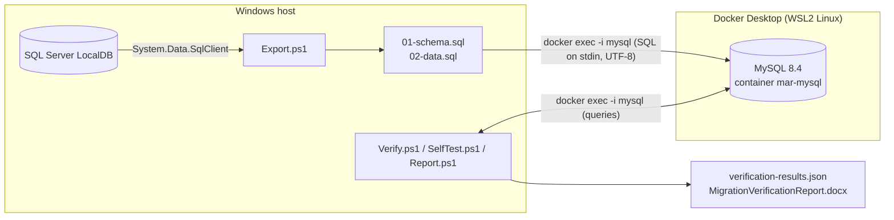

# DM_MySQL - MySQL 8.4 in a Docker Linux container (extra work, not a numbered iteration)

> **Status.** This is an extra migration that was built before iteration 2 was defined. It is **not** a numbered iteration: iteration 2 is SQL Server -> SQLite in a Dockerized Linux container ([DMPLAN_2.md](DMPLAN_2.md), record in [DM2.md](DM2.md)) and iteration 3 will be PostgreSQL. This file was previously called `DMPLAN_2.md` and its content is unchanged apart from this header. Its report is `Scripts\export\mysql\MigrationVerificationReport-mysql.docx`.

Follows [DMPLAN_1.md](DMPLAN_1.md) (iteration 1: SQL Server -> SQLite, native on Windows; results in [DM1.md](DM1.md)). This document records what the MySQL work built, how to run it, what it proved and what it did not.

## 1. Outcome

| | SQLite (iteration 1, re-run after the refactor) | MySQL 8.4 in Docker (extra) |
|---|---|---|
| Command | `Scripts\dbmigrate.cmd all --target sqlite` | `Scripts\dbmigrate.cmd all --target mysql` |
| Exit code | 0 | 0 |
| Checks passed | 41 of 41 | 44 of 44 |
| Source rows verified identical | 155 of 155 | 155 of 155 |
| With awkward test data added to the source | 160 of 160 | 160 of 160 |
| Self-test (repeatable export, independent diff, damaged copy caught) | passed | passed |
| Independent diff tool | `sqldiff` | `CHECKSUM TABLE` |
| Word report | `Scripts\export\sqlite\MigrationVerificationReport.docx` | `Scripts\export\mysql\MigrationVerificationReport.docx` |

The per-table row hashes (SHA-256 over the canonical rows) are **identical between the SQLite and MySQL runs** for the same source data, for example Roles `083c2efe5cfe6dcb...` and Users `a90ce7a28ea15036...` (real data). That is cross-engine evidence, not just source-vs-target.

## 2. Why a Linux container

- The intended production target is Linux. MySQL on Linux differs from a Windows install in ways that only show up there, chiefly **case-sensitive table names** (`lower_case_table_names=0`); this schema uses CamelCase names (`AuditLogs`, `UserRoles`).
- The source cannot move: SQL Server **LocalDB is Windows-only**. Docker is therefore used for the *target only*. Export, verification and the report still run on Windows in PowerShell.
- Docker Desktop was already installed (version 24.0.6, WSL2 backend, Linux kernel `5.15.133.1-microsoft-standard-WSL2`). Nothing had to be installed to start.
- Limits: the container kernel is a Linux kernel, not your production distribution. A final smoke test on the real server is still worthwhile. Pin the image tag to the production MySQL version.

## 3. How it fits together



- The MySQL client runs **inside** the container via `docker exec -i`; SQL is piped on stdin as UTF-8. No port is published, so there are no port conflicts and nothing is exposed on the network.
- The tool creates the container on first use (`docker run -d --name mar-mysql ... mysql:8.4 --character-set-server=utf8mb4 --collation-server=utf8mb4_0900_as_ci`), starts it if stopped, and waits until the server answers over **TCP on 127.0.0.1**. That probe matters: the image runs a temporary init server with networking off, which answers a socket ping just before it restarts.
- Tables are loaded in foreign-key dependency order inside one transaction with foreign-key checks left **on**, so MySQL itself validates every relationship during the load.

## 4. What changed in the code

| File | Change |
|---|---|
| `Scripts\migration\dialects\mysql.ps1` | **New.** MySQL 8 DDL/DML rendering, the `docker exec` client, `information_schema` schema checks, behaviour tests on a scratch database, `CHECKSUM TABLE` comparison, known-differences list. |
| `Scripts\migration\Common.ps1` | Docker helpers (`Get-DockerExe`, `Invoke-Docker`, `Assert-DockerRunning`, `Confirm-DockerContainer`); source column **collation** added to the neutral model. |
| `Scripts\migration\dialects\sqlite.ps1` | Brought onto the generalised dialect interface (below). Behaviour unchanged. |
| `Scripts\migration\Import.ps1`, `Verify.ps1`, `SelfTest.ps1` | Use the dialect interface instead of assuming a target is a file. |
| `Scripts\migration\Report.ps1` | Word report takes the target's name and its known-differences list from the results JSON, so it reads correctly for SQLite and MySQL. |
| `Scripts\migration\migration.config.json` | New `mysql` target block. |

**Dialect interface.** A target is no longer a file path. Each dialect returns these members from `New-Dialect`:

| Member | Purpose |
|---|---|
| `Name`, `DisplayName`, `KnownDifferences` | Identity and the list printed in the report's "known differences" section. |
| `RenderSchema`, `RenderData` | Generate `01-schema.sql` / `02-data.sql`. |
| `TargetId(settings, override)` | The thing being verified: a file path (SQLite) or a database name (MySQL). `--db` overrides it. |
| `Exists`, `Fingerprint` | Does the target exist; a content fingerprint (SQLite file hash; none for MySQL). |
| `Import` | Create the target from the SQL files (`--recreate` semantics, exit code 3 if it exists). |
| `ReadRows`, `Query`, `Run` | Read every row as canonical hex cells; run a query; run SQL. |
| `Version` | Client/server description recorded in the results. |
| `SchemaChecks`, `Behaviour` | Structure and rule checks. |
| `NewScratchId`, `Clone`, `Remove`, `Diff`, `DamageSql` | Self-test support: throw-away copies, the engine's own comparison, deliberate damage. |

## 5. Running it

Prerequisites: Docker Desktop **running** (Linux containers). If the tool reports that the Docker daemon is not running, start Docker Desktop, wait for it to say running, and retry.

```
cd c:\Users\Bilbo\Documents\dev\aspnet\master-antique-repair
Scripts\dbmigrate.cmd all      --target mysql
Scripts\dbmigrate.cmd export   --target mysql
Scripts\dbmigrate.cmd import   --target mysql --recreate
Scripts\dbmigrate.cmd verify   --target mysql
Scripts\dbmigrate.cmd selftest --target mysql
Scripts\dbmigrate.cmd report   --target mysql
```

Exit codes: `0` success / all checks pass, `1` verification found differences, `2` configuration, tool or connection error, `3` refused (the target database already exists and `--recreate` was not given).

Configuration (`Scripts\migration\migration.config.json`, `targets.mysql`):

| Key | Value | Meaning |
|---|---|---|
| `dialect` | `mysql` | Selects `dialects\mysql.ps1`. |
| `runner.mode` | `docker` | The only mode implemented for MySQL. |
| `runner.container` | `mar-mysql` | Container name. |
| `runner.image` | `mysql:8.4` | Image tag. **Change to the version you run in production.** |
| `runner.autoStart` | `true` | Create the container if it does not exist. |
| `database` | `masterantique` | Database the data is loaded into. |
| `user` | `root` | MySQL user. |
| `passwordEnv` | `MAR_MYSQL_PASSWORD` | Environment variable holding the root password. If unset, a throwaway default (see `Mysql-Password` in `mysql.ps1`) is used; that is only acceptable for this local test container. The password is passed to the client with `docker exec -e MYSQL_PWD=...`, so it is visible in the host process list while a command runs. |

Container lifecycle: the first run downloads the image (roughly 800 MB) and creates the container; later runs reuse it. The tool never removes it. When finished: `docker stop mar-mysql`, or `docker rm -f mar-mysql` to delete it (the image stays on disk).

`import --recreate` drops and recreates the `masterantique` database. `verify` and `selftest` create short-lived scratch databases (`masterantique_behaviour`, `masterantique_second`, `masterantique_damaged`) and drop them again, so the delivered database is never modified by tests.

## 6. How SQL Server maps to MySQL

| Concern | Decision | Why |
|---|---|---|
| Integers | `int`/`bigint`/`smallint` -> same; `tinyint` -> `TINYINT UNSIGNED` | SQL Server `tinyint` is 0-255. |
| Booleans | `bit` -> `TINYINT(1)` + `CHECK (col IN (0,1))` | MySQL 8.0.16+ enforces `CHECK`. A behaviour test proves it. |
| Text | `nvarchar(n)` -> `VARCHAR(n)`, `nvarchar(max)` -> `LONGTEXT`, all `utf8mb4` | Full Unicode including emoji. |
| Collation | SQL Server `..._CI_AS` -> `utf8mb4_0900_as_ci`; `..._CS_AS` -> `utf8mb4_0900_as_cs`; anything else is an error | Mirrors SQL Server's case-insensitive, accent-sensitive default so usernames differing only by case still collide. |
| Dates | `datetime` -> `DATETIME(6)`; the value's 7th fractional digit must be `0` or the export stops | SQL Server `datetime` has millisecond precision, which fits exactly. |
| Binary / GUID | `varbinary` -> `LONGBLOB`; `uniqueidentifier` -> `CHAR(36)` | Not present in the current data; mapped for completeness. |
| Identity | `AUTO_INCREMENT`; after loading, `ALTER TABLE ... AUTO_INCREMENT = last + 1` | Next id continues from the source. |
| Filtered unique index `IX_Users_Name_Active` (`WHERE DeletedAt IS NULL`) | Functional unique index `((IF(DeletedAt IS NULL, Name, NULL)))` | MySQL has no partial indexes. NULLs never collide, so soft-deleted rows do not block name reuse. Only `IS [NOT] NULL` filters are translated; any other filter is an error rather than a silently dropped rule. |
| Foreign keys | Inside `CREATE TABLE`, after the indexes; `ON DELETE` actions preserved | Declaring indexes first stops MySQL creating and dropping implicit indexes for the keys. |
| Index names | Prefixed with the table name when a name repeats across tables (e.g. `IX_UserId`) | Same rule as every target. |
| Identifiers | Backtick-quoted, exact case; more than 64 characters is an error | MySQL's limit. |
| Special characters in strings | Values containing a backslash or control characters are sent as `CONVERT(X'..' USING utf8mb4)` | Independent of `sql_mode` and of how the pipe treats line endings. |

## 7. What was verified

Everything in [DMPLAN_1.md](DMPLAN_1.md)'s verification list applies unchanged; the MySQL specifics:

- **Row-by-row content.** Every cell of every row is read back as hex (`i:` integer/boolean, `t:` text/date, `b:` binary, `~` NULL) and compared field by field, plus a per-table SHA-256. NULL is distinct from an empty string. Credential columns (`PasswordHash`, `SecurityStamp`) are compared but never printed.
- **Schema, from `information_schema`:** tables; columns (name, order, type, NOT NULL, default, auto-increment, collation); primary keys; foreign keys with `ON DELETE` action; indexes (name, unique, filtered); index columns; the filtered-index expression; auto-increment tables and their **next values** (the query sets `information_schema_stats_expiry=0`, otherwise MySQL serves cached values for up to a day).
- **Integrity:** `CHECK TABLE` on every table, and an orphan-row query per foreign key.
- **Behaviour tests** (on a scratch database rebuilt from the exported SQL): duplicate active username rejected; case-only duplicate rejected; reusing a soft-deleted username allowed; orphan foreign key rejected; boolean `CHECK` rejects 2; new `Roles` row continues the source identity value; deleting a ticket cascades to its comments.
- **Business summaries:** the same SQL text runs on both engines (MySQL with `ANSI_QUOTES` set) - users by type and by role, active vs soft-deleted, tickets by state, audit events by action, date ranges.
- **Self-test:** a second export is byte-identical to the first; a database built from the second export has the same `CHECKSUM TABLE` values per table as the delivered one; a deliberately damaged copy (one comment changed, one ticket deleted with foreign-key checks off) is reported as FAILED with `Comments`, `Id`, `Text` and `Tickets`, `Id` named.

Awkward data was added to the source for one run (CRLF, tabs, backslashes, quotes, emoji, CJK text, an empty string, NULLs, a year-9999 date, a soft-deleted user with an accented, apostrophe-containing name) and removed afterwards. All of it round-tripped identically. The same comment was inspected directly in the container: CRLF (`0D0A`), emoji (`F09F9880`) and backslashes were intact, and the empty-string and NULL comments were distinguishable.

## 8. Problems found and fixed

| Problem | Effect | Fix |
|---|---|---|
| `@(Mysql-Query ...)` wrapped the returned list in a second array | First import crashed (`Cannot convert ArrayList to Int32`) after the container was already up | Call sites use the list directly. Same class of bug as in the SQLite dialect. |
| MySQL caches `AUTO_INCREMENT` in `information_schema` | Counter check could read stale values | `information_schema_stats_expiry=0` per query. |
| Init-server race on first start | A socket ping can succeed just before the server restarts | Readiness is probed over TCP on 127.0.0.1. |
| No partial indexes | The username-reuse rule would be lost | Functional unique index plus a behaviour test that exercises it. |
| Generic code assumed a target is a file | Blocked any server-hosted target | Dialect interface generalised (section 4). |
| A chart label was clipped in the report | "Auto-increment counters continue from the source identity values" overflowed | Check renamed "Auto-increment counters (continue from source values)". |

## 9. Not done / next

- **SQLite inside a Linux container** was not done. It would need only the SQLite client in a container; the export files are plain UTF-8 with LF endings and load on Linux unchanged.
- **PostgreSQL** is the natural next dialect (native partial indexes, `GENERATED ... AS IDENTITY`); it would implement the same interface and can reuse the Docker helpers.
- Untested paths: the Docker daemon being stopped mid-run, a wrong root password left by an older container, and any runner mode other than `docker` for MySQL.
- Known gap, SQLite side: SQLite compares text case-sensitively while SQL Server does not, so new rows inserted straight into SQLite are not protected against case-only duplicate usernames. The migrated data itself satisfies the rule, and the MySQL target does enforce it.
- The report and results record `TargetFingerprint` as empty for MySQL (there is no single file to hash); per-table hashes and `CHECKSUM TABLE` values stand in for it.

## 10. Repeating this from scratch

1. Start Docker Desktop and wait until it reports running.
2. From `cmd.exe` in the repository root: `Scripts\dbmigrate.cmd all --target mysql`.
3. Expect the last lines `VERIFICATION PASSED - 44 of 44 checks passed; 155 of 155 source rows verified identical`, then `SELF-TEST PASSED`, then the report path; `echo %ERRORLEVEL%` prints `0`.
4. Open `Scripts\export\mysql\MigrationVerificationReport.docx` (`Scripts\export\` is gitignored: it contains password hashes).
5. Optional direct look: `docker exec -e MYSQL_PWD=<your password> mar-mysql mysql -uroot -D masterantique -e "SELECT COUNT(*) FROM Users"` prints 12 on the current data.
