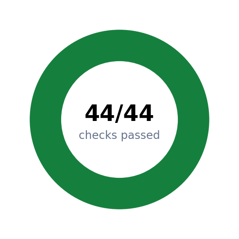
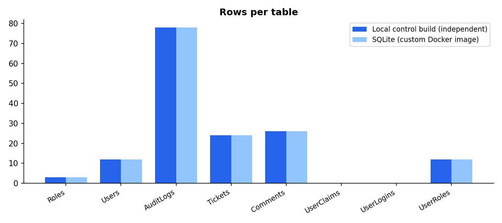
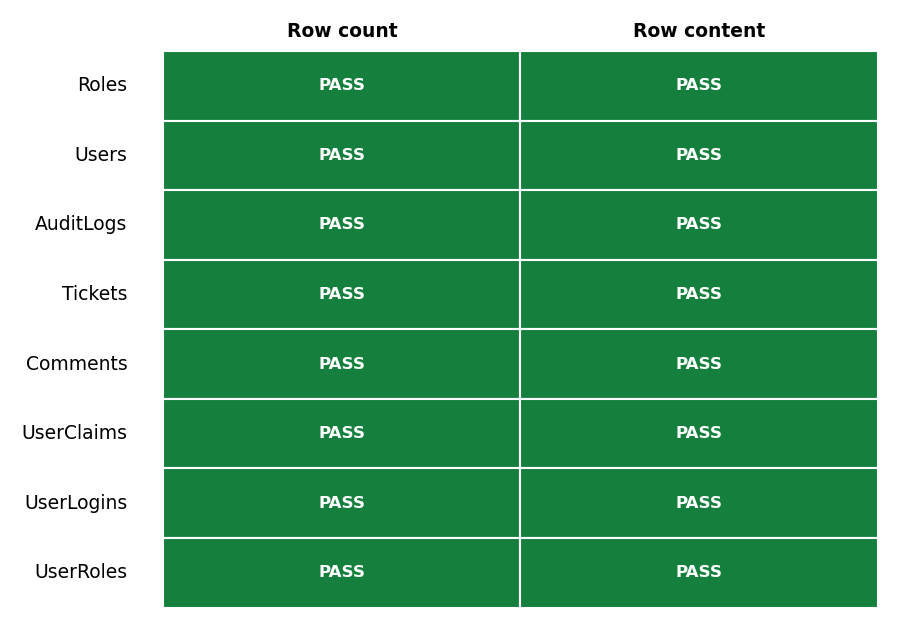
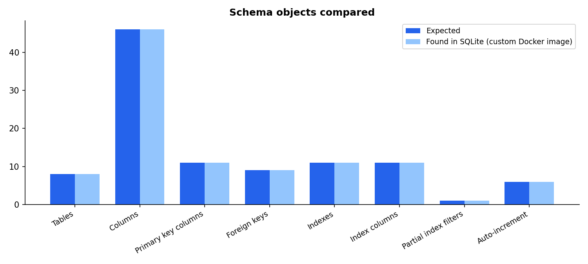
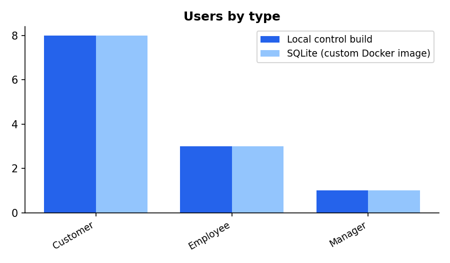
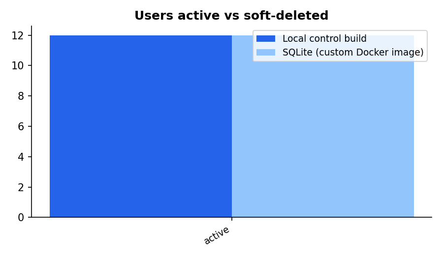
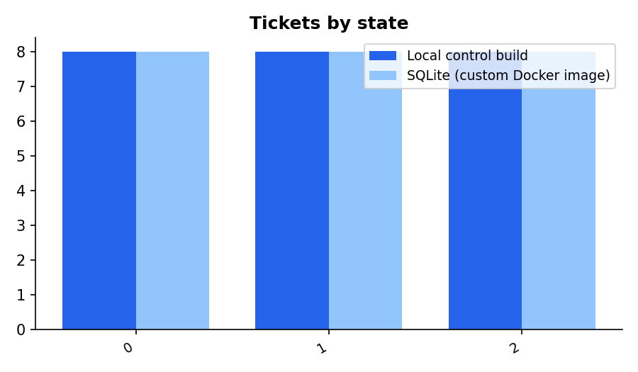
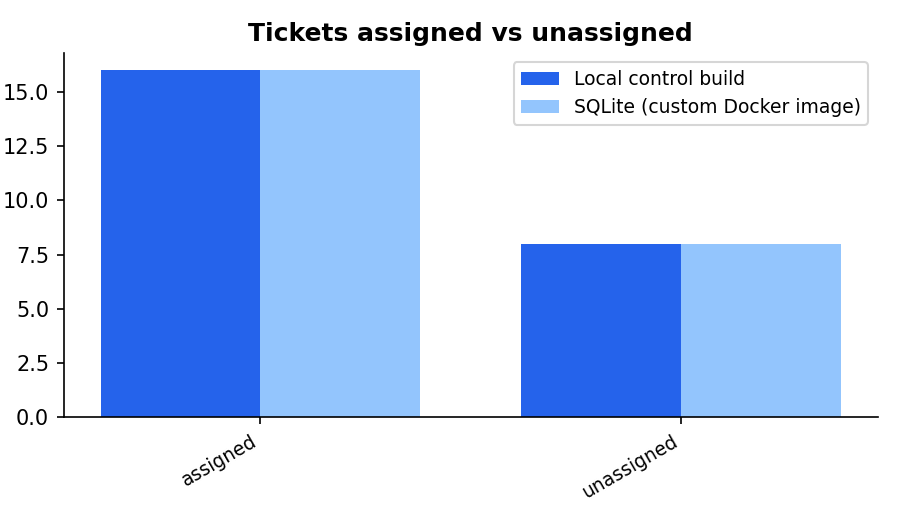

# Database Migration Verification Report

### MasterAntiqueRepair: independent local build cross-checked against SQLite (custom Docker image)

**Iteration 3 — SQLite baked into a custom Docker image (independent verification, credentials sanitized)**

## VERIFICATION PASSED

44 of 44 checks passed | 155 of 155 rows verified identical | 8 tables

- Source: n/a by design - iteration 3 has no live SQL Server connection and does not consult iteration 1/2's output artifacts. Correctness is established by cross-checking two independently-built copies of the same sanitized input, both produced fresh in this run on this Linux host: (1) the delivered Docker image, and (2) a throwaway control database built directly with the local sqlite3 CLI, no Docker involved.
- Source database: n/a (see SourceServer)
- Target: SQLite (custom Docker image), /data/masterantique.sqlite, 3.45.3

## 1. Executive summary

Two databases were built independently on this Linux host from the same sanitized schema and data — a Docker image (the delivered artifact) and a throwaway local control database built directly with the sqlite3 CLI, no Docker involved — and cross-checked against each other. Every check passed. All 155 rows across 8 tables were found identical between the two builds, the schema objects match, the database rules the application depends on still work, and every migrated account's credentials were confirmed sanitized (see section 7).

Everything in this report was produced by deterministic scripts (bash, Python, sqlite3, docker), not by a language model at run time: the same inputs always produce the same results.

| Measure | Reference | SQLite (custom Docker image) | Result |
|---|---|---|---|
| Tables | 8 | 8 | PASS |
| Rows in all tables | 155 | 155 | PASS |
| Rows verified identical | 155 | 155 | PASS |
| Checks passed | 44 | 44 | PASS |

## 2. Scope and method

**What was checked.** All application tables: Roles, Users, AuditLogs, Tickets, Comments, UserClaims, UserLogins, UserRoles.

**A note on source of truth.** Iteration 3 has no live SQL Server connection from this Linux host, and does not consult any output artifact from iteration 1 or iteration 2. "Reference" throughout this report means the local control database — built fresh, in this run, directly with the sqlite3 CLI from the same sanitized input the Docker image was built from. Agreement between two independently-built copies is the evidence, not agreement with a stored answer from a prior iteration.

**How it was checked:**

- Row counts and canonically-ordered row content, hashed and compared between the two independent builds.
- Schema facts (tables, columns, keys, indexes, the partial active-username index, auto-increment tables) introspected independently on both builds and compared to each other.
- The same 10 business-summary queries run on both independent builds, compared to each other.
- 5 behaviour tests exercised on a scratch copy inside the container, so the delivered database was never modified.
- Self-test of the tooling itself: a second build must be byte-identical, an independently copied database must match, and a deliberately damaged copy must be caught and named.

## 3. Results at a glance



*Figure 1. Overall outcome of all checks.*



*Figure 2. Row count of every table, reference versus this iteration's built image.*



*Figure 3. Verification status of each table.*

## 4. Data verification in detail

| Table | Ref. rows | Target rows | Diff | Rows identical | Result | Row hash (16) |
|---|---|---|---|---|---|---|
| Roles | 3 | 3 | 0 | 3 | PASS | fa72c1c50028b89d |
| Users | 12 | 12 | 0 | 12 | PASS | 2c7ed480d10ca53f |
| AuditLogs | 78 | 78 | 0 | 78 | PASS | 92a70e5ba890103c |
| Tickets | 24 | 24 | 0 | 24 | PASS | 45b74e68185c9356 |
| Comments | 26 | 26 | 0 | 26 | PASS | ba6b7561101ebd73 |
| UserClaims | 0 | 0 | 0 | 0 | PASS | e3b0c44298fc1c14 |
| UserLogins | 0 | 0 | 0 | 0 | PASS | e3b0c44298fc1c14 |
| UserRoles | 12 | 12 | 0 | 12 | PASS | 0b9311fed9992ea3 |

## 5. Schema and integrity



*Figure 4. Schema object counts, expected versus found.*

| Check | Expected | Found | Result |
|---|---|---|---|
| Tables | 8 | 8 | PASS |
| Columns (name, order, type, NOT NULL, PK position, default) | 46 | 46 | PASS |
| Primary key columns | 11 | 11 | PASS |
| Foreign keys (column, target, ON DELETE action) | 9 | 9 | PASS |
| Indexes (name, unique, partial) | 11 | 11 | PASS |
| Index columns | 11 | 11 | PASS |
| Partial index filters (e.g. active-username rule) | 1 | 1 | PASS |
| Auto-increment (identity) tables | 6 | 6 | PASS |
| SQLite integrity_check (docker image) | - | - | PASS |
| SQLite foreign_key_check (orphan rows) | - | - | PASS |

## 6. Business-level summaries

The same question was asked of the reference and the built image; the answers must match.










| Summary | Answer (identical in target when PASS) | Result |
|---|---|---|
| Users by type | Customer|8; Employee|3; Manager|1 | PASS |
| Users active vs soft-deleted | active|12 | PASS |
| Users per role | Customer|8; Employee|3; Manager|1 | PASS |
| Tickets by state | 0|8; 1|8; 2|8 | PASS |
| Tickets assigned vs unassigned | assigned|16; unassigned|8 | PASS |
| Audit events by action | 0|11; 1|1; 2|24; 3|16; ... | PASS |
| Comments per ticket (distribution) | 3|6; 4|2 | PASS |
| Comment and commented-ticket totals | 26|8 | PASS |
| Ticket date ranges | 2026-09-07 08:20:34.0000000|2026-09-16 08:39:18.0000000|2026-09-07 11:26:34.0000000|2026-09-14 10:16:58.9100000|2026-09-11 00:13:34.0000000|2026-09-17 14:15:58.9100000 | PASS |
| Account and audit date ranges | 2026-09-10 14:41:58.9100000|2026-09-11 16:41:58.9100000|2026-09-07 08:20:34.0000000|2026-09-17 14:43:56.6430000 | PASS |

## 7. Behaviour tests, credential sanitization, and tooling self-test

Behaviour tests were run on a throw-away copy inside the container; the delivered database was never modified.

| Behaviour | Result |
|---|---|
| Duplicate active username is rejected | PASS |
| Reusing a soft-deleted username is allowed (partial unique index) | PASS |
| Orphan foreign key insert is rejected | PASS |
| Boolean CHECK constraint rejects values other than 0/1 | PASS |
| New Roles row continues the source identity sequence | PASS |

### Credential sanitization

This is a one-time bootstrap migration; a forced password reset on next login is acceptable, so no usable credential is carried into the target at all.

| Check | Result |
|---|---|
| All Users rows have PasswordHash/SecurityStamp NULL and MustResetPassword=1 (local build) | PASS |
| All Users rows have PasswordHash/SecurityStamp NULL and MustResetPassword=1 (docker build) | PASS |
| Non-credential Users columns unchanged by sanitization (12 rows cross-checked against raw source) | PASS |

### Self-test of the migration tooling

| Area | Test | Result |
|---|---|---|
| Determinism | Second build is byte-identical to the first | PASS |
| Independent | Scratch copy matches the delivered database (dump diff) | PASS |
| Negative test | A damaged copy (Comments.Id=1 text changed, Tickets.Id=1 deleted) is detected | PASS |

## 8. Differences found

**None.** No differences were found.


## 9. Intentional exclusions and known differences

- The Entity Framework migration history table (`__MigrationHistory`) is not migrated.
- The SQL Server `dbo` schema prefix is dropped; table/column names keep their spelling and case.
- The database is baked into the Docker image at build time (docker build), not loaded into a running container afterward as in iteration 2.
- Verification does not consult any iteration 1/2 output artifact. It cross-checks two databases built independently in this run from the same sanitized input: the Docker image and a local sqlite3-CLI control build.
- Every migrated Users row has PasswordHash and SecurityStamp set to NULL and MustResetPassword set to 1 - the real password hashes are never baked into this image or committed to git. This is a deliberate one-time-bootstrap policy: a forced password reset on next login is acceptable, so there is no need to carry a usable credential into the target at all.

## 10. Reproducibility

From `tools/phase1/dbmigrate/iteration3/` on a Linux host with Docker:

```
./dbmigrate3.sh all --recreate
```

| Item | Value |
|---|---|
| Tooling git commit | 456709f |
| Target client | 3.45.3 |
| 01-schema.sql SHA-256 (includes MustResetPassword column) | 72d62510dfc78e0be541addc5c2f3d15d26fb586b0d52eb487c4b04d0f67a017 |
| 02-data-sanitized.sql SHA-256 (committed; credentials redacted) | 4752e8c463068a5d3767f0f8441c2dd39ced67985db960a1e823894b77b17c32 |
| SQLite (custom Docker image) target | /data/masterantique.sqlite |

## 11. Sign-off

| Role | Name | Signature | Date |
|---|---|---|---|
| Prepared by |  |  |  |
| Technical reviewer |  |  |  |
| Business approver |  |  |  |

## Appendix A. Full row hashes

SHA-256 over all rows of each table (canonical form, fixed order), computed on the reference database and on the built image.

| Table | Reference SHA-256 | Target SHA-256 | Match |
|---|---|---|---|
| Roles | fa72c1c50028b89de1f99d8cbabf3c36ab1379be88059a71a0dcb1bdaff70416 | fa72c1c50028b89de1f99d8cbabf3c36ab1379be88059a71a0dcb1bdaff70416 | PASS |
| Users | 2c7ed480d10ca53fa56f515ec33eedf9bdd5bae28738706cffbf62dfb7cc132c | 2c7ed480d10ca53fa56f515ec33eedf9bdd5bae28738706cffbf62dfb7cc132c | PASS |
| AuditLogs | 92a70e5ba890103cb345061041f626f1b7edb586b076af6d2db73bd3f9f8c0ce | 92a70e5ba890103cb345061041f626f1b7edb586b076af6d2db73bd3f9f8c0ce | PASS |
| Tickets | 45b74e68185c9356cd53ac7da022ace7c26eba07d3e344fdd04fe733fc6954d4 | 45b74e68185c9356cd53ac7da022ace7c26eba07d3e344fdd04fe733fc6954d4 | PASS |
| Comments | ba6b7561101ebd73f9928dc404a7a6b0a375cb2c48bfded19085e9eb8a72acd9 | ba6b7561101ebd73f9928dc404a7a6b0a375cb2c48bfded19085e9eb8a72acd9 | PASS |
| UserClaims | e3b0c44298fc1c149afbf4c8996fb92427ae41e4649b934ca495991b7852b855 | e3b0c44298fc1c149afbf4c8996fb92427ae41e4649b934ca495991b7852b855 | PASS |
| UserLogins | e3b0c44298fc1c149afbf4c8996fb92427ae41e4649b934ca495991b7852b855 | e3b0c44298fc1c149afbf4c8996fb92427ae41e4649b934ca495991b7852b855 | PASS |
| UserRoles | 0b9311fed9992ea3979f2184d104883da159ceaffe975a81f47d47cbac024987 | 0b9311fed9992ea3979f2184d104883da159ceaffe975a81f47d47cbac024987 | PASS |